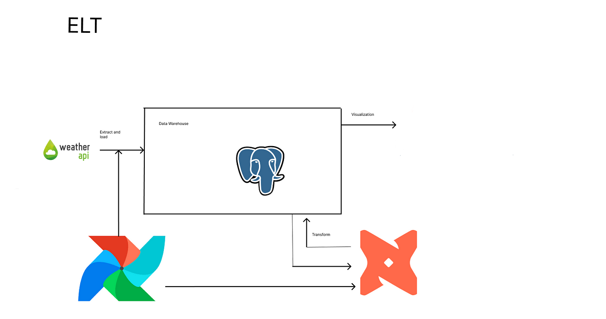
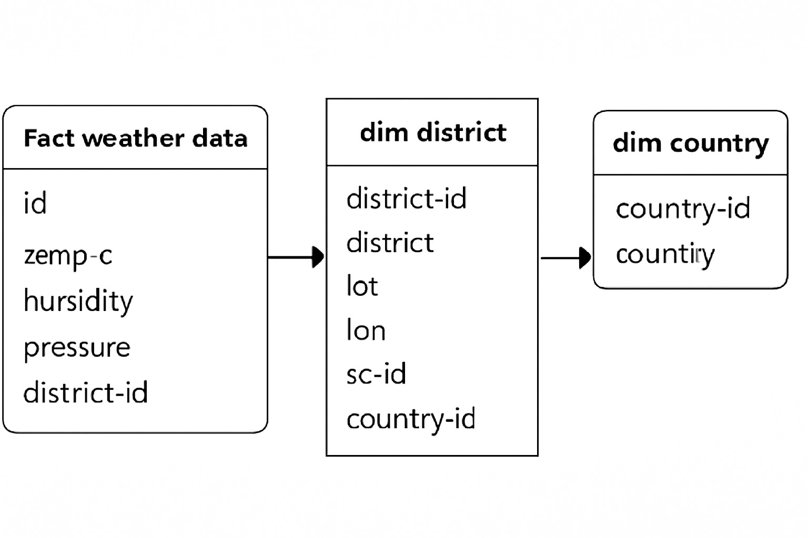

# 🚀 Simple ELT Pipeline using Airflow, DBT, and PostgreSQL

This project demonstrates how to set up a basic **ELT (Extract, Load, Transform)** pipeline using **Apache Airflow** for orchestration, **DBT** for transformation, and **PostgreSQL** as the data warehouse. Note, that this architecture is easily replicable to other Data Warehouses like **Snowflake**, **RedShift**, **BigQuery**, etc.

---

## 📌 Objective

To build a minimal and functional **ELT pipeline** that:
- Ingests raw data (Directly from **WeatherAPI** - Full load and Incremental/Batch load),
- Loads it into a **PostgreSQL** database,
- Uses **DBT** to transform the data,
- And orchestrates the entire flow using **Airflow**.


---

## 🧱 Data Architecture Overview

### 🔄 ELT Flow



1. **Extract**: Data from WeatherAPI.
2. **Load**: Loaded into raw PostgreSQL table `weather`.
3. **Transform**: Using DBT, we build a star schema:
   - One central **fact_weather_table**.
   - Two dimension tables: `dim_district`, `dim_country`.

---

## 🗃️ Dummy Data Model

Here's the structure of our simplified star schema:
There are very high number of columns in fact table, for simplicity of understand in a diagram, I've placed only few columns.



- **fact_weather_table**: Central fact table containing weather logs.
- **dim_district**: Contains district-level metadata.
- **dim_country**: Contains country-level metadata.

---
# Running dbt in isolation
## Step1:
```
pip install dbt-core dbt-postgres
```

## Step 2: initialize dbt project
```
dbt init <project_name>
```

## Step 3: change directory to project
```
cd /path/to/<project_name>
```

## Step 4: create packages.yml file inside your dbt project, these packages are required for introducing surrogate keys
```
packages:
  - package: dbt-labs/dbt_utils
    version: [">=0.8.0", "<1.0.0"]
```

## Step 5 : Run
```
dbt deps
```

## Step 6 : Run
```
dbt debug
```

### SQL For Simulation
```
create table weather (
	id serial primary key,
	data text,
	created_at_utc timestamp
);

INSERT INTO public.weather
(id, "data", created_at_utc)
VALUES(nextval('weather_id_seq'::regclass), 'test1', now()),
(nextval('weather_id_seq'::regclass), 'test2', now()-interval '1 min'),
(nextval('weather_id_seq'::regclass), 'test3', now()-interval '2 min'),
(nextval('weather_id_seq'::regclass), 'test4', now()-interval '3 min');


select 
	*
from weather w ;

select 
	*
from transformed."temp" t 
```


# Running dbt with airflow
# Step 1:  Clone the repo
```
git clone https://github.com/abhinandanshrestha/airflowdbt
cd airflowdbt/
mkdir -p ./dags ./logs ./plugins ./config
echo -e "AIRFLOW_UID=$(id -u)" > .env
```

# Step2:
```
docker compose up --build -d
```

# Step3:
```
docker exec -it <worker_container> bash
cd weather/
dbt debug
```


